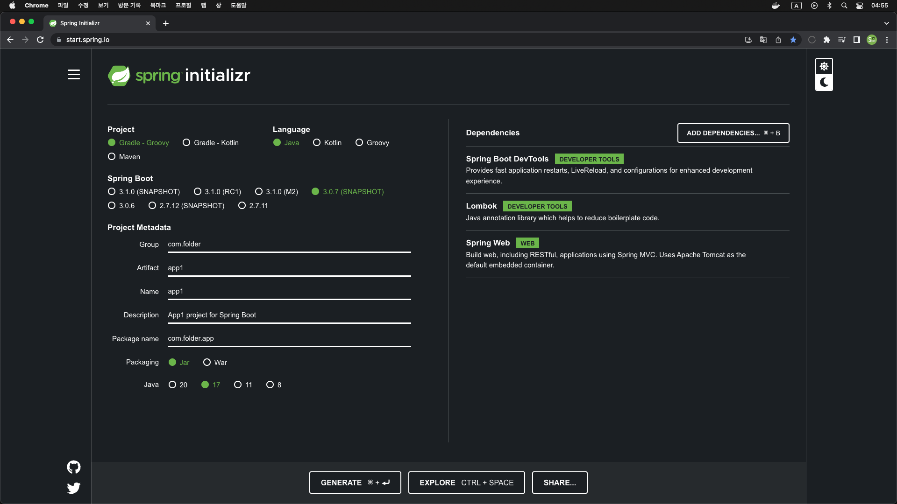

# DevCloud
DevContainer + Spring Cloud (Gateway + Config + Eureka)

### Architecture
</img>

### Spring App initializr

#### - App1
</img>

#### - App2
</img>

### Cloud Gateway initializr

</img>

### Cloud Eureka initializr

#### - Server
</img>

#### - Client
</img>

### Cloud Config initializr

#### - Server
</img>

#### - Client
</img>

### Spring Project
> * [Spring initializr](https://start.spring.io/)
> * [Application Properties](https://docs.spring.io/spring-boot/docs/current/reference/html/application-properties.html)

> * [Cloud Gateway](https://spring.io/projects/spring-cloud-gateway)
> * [Cloud Gateway Docs](https://docs.spring.io/spring-cloud-gateway/docs/4.0.5-SNAPSHOT/reference/html/)

> * [Cloud Config](https://spring.io/projects/spring-cloud-config)
> * [Cloud Config Docs](https://docs.spring.io/spring-cloud-config/docs/4.0.3-SNAPSHOT/reference/html/)

> * [Cloud Eureka](https://spring.io/projects/spring-cloud-netflix)
> * [Cloud Eureka Docs](https://docs.spring.io/spring-cloud-netflix/docs/4.0.2-SNAPSHOT/reference/html/)

----
### YouTube Link

> * [1. Cloud 소개](https://youtu.be/mlJWoXJm034)
> * [2. Gateway 설정하기](https://youtu.be/ZAsjRGkzbC8)
> * [3. Eureka 설정하기](https://youtu.be/ZmNc4yZ9V90)
> * [4. Config 설정하기 1부](https://youtu.be/65PwJMJbKYQ)
> * [5. Config 설정하기 2부](https://youtu.be/8Y2OSavfizo)
> * [6. Cloud JWT 소개](https://youtu.be/abMlXvJo3T4)
> * [7. 개발공간 만들기](https://youtu.be/ShYVGJgFhfw)
> * [8. Token & Filter](https://youtu.be/sKikmssOR4o)
> * [9. Token에 사용자 정보 넣어주기](https://youtu.be/9CIKOcdtId4)
